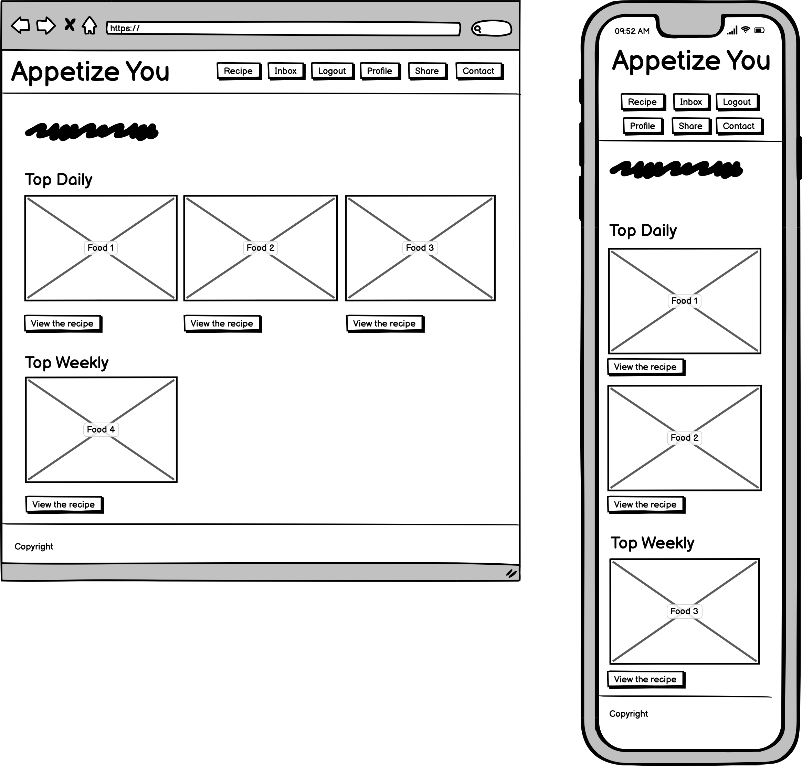

# **Appetize You**

## **Purpose**

"Turn crisis into an opportunity."

COVID-19 has highly impacted sole proprietors. However, those with a strong conviction found or are finding a new opprotunity through the crisis.

The enhancement of the independent media industry brought a new possibility to the world.

Youna Kang, AKA CodeMiko, is a full time Twitch streamer and YouTuber who is formally a 3D designer and moved to Los Angelos in 2020 as she found a new job at the new studio. Unfortunately, COVID-19 stroke the world in 2020 and she was the one who has been laid off from the studio. With the thought of it being the last, Youna brought her skill as a formal 3D designer and technician to the independent media industry, created a virtual character named CodeMiko and has 434K subscribers on YouTube and 917K followers on Twitch.

Such flow has also opened a new pathway for the food industry. Food experts, chefs, culinary researchers, etc. are joining the battle and started to share their recipe on the media. Most of them are sharing their recipes on YouTube with written details on video description section or on comments. Those of who already have huge fan bases might have their own website or a blog, but new starters might have difficulties to afford a budget to maintain their website, etc and that is why we came up with the idea of *Appetize You*.

## **Functionality / features**

*Appetize You* promises to provide funtionalities / features like:

- **Authentication system**

Anyone can upload their recipe of any kind once they register to the site.

- **Categorizable recipe upload**

Huge food recipe websites like [Taste](https://www.taste.com.au/) and [Epicurious](https://www.epicurious.com/) are doing a fantastic job to let end users to share their recipe through the net. However, one downside of their websites is that they do not categorize recipes in depth like Western or Eastern, Cold or Hot, Dessert or Main, etc. We would like to offer the users to categorize their precious recipe in more depth so that the closest result can be exposed on top of the page.

- **Automatic ingredient quantity conversion based on the yield**

The amount of the ingredient required will be automatically calculated based on the yield.

- **Recipe review**

Users can not only upload their recipe, but also share the feedback and review the recipe.

- **1-on-1 messaging through the website**

Users can privately message each other to have a discussion.

## **Target audience**

The target audiences of *Appetize You* would be:

- food experts, chefs, culinary researchers or anyone who needs a well organized web application to share their written recipes with detailed explanation and pictures.
- those who are willing to cook a taste guaranteed delicious meal for themselves.

## **Tech stack**

### **Front-End**
- JavaScript
- ReactJS
- HTML/CSS

### **Back-End**
- Ruby
- Ruby on Rails
- PostgreSQL
- AWS

### **Deployment**
- Heroku (for Back-End)
- Netlify (for Front-End)

## **Data Flow Diagram (DFD)**

## **Application Architecture Diagram (AAD)**

## **User Stories**

|User|Action|Reason|
|-|-|-|
|As a generic user|I want to login to my account.|So that I could view recipes on the page.|
|As a generic user|I want to contact to the person who maintain the website.|So that I could ask admins about how the user details and recipes are handled.|
|As a generic user|I want to communicate with other users privately.|So that I could share some information deeply.|
|As an author|I want to share a recipe.|So that I could show off my dish to the public.|
|As an author|I want to edit the recipes I uploaded.|So that I could correct any mistakes and enhance the description if needed.|
|As a viewer|I want to search for the recipe.|So that I could find a specific food recipe that I am looking for.|
|As a viewer|I want to rate the recipe.|So that I could explain other potential viewers how well made the recipe is.|
|As a viewer|I want to contact the author.|So that I could inquire any uncertain details of the recipe.|

## **Wireframes**

## **Trello board**